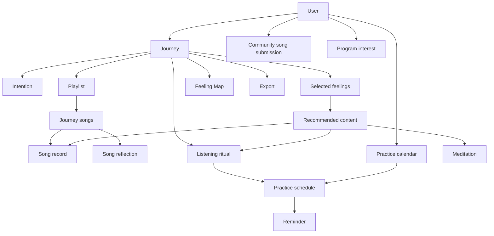

# Content and Data Model

**Product:** Music as Medicine  
**Version:** 0.1  
**Status:** In review

## Purpose

This document defines the information Music as Medicine needs to guide a user from intention to playlist, reflection, Feeling Map, ritual, and export.

It covers both the content experienced by the user and the information the application must handle behind the scenes. It is a product model, not yet a technical database specification.

## Guiding principles

- The user's own language remains primary.
- Structured choices make the experience easier without limiting free expression.
- The Feeling Map emerges through additional coaching questions and prompts rather than opaque interpretation.
- The experience should feel as human as possible and keep the user in authorship of meaning.
- Every generated result can be edited by the user.
- Journal storage is chosen separately for each journey.
- Account information, journal content, marketing permission, and program interest remain distinct.
- The first version works without a streaming-service connection.
- Content should be reusable across future playlists, rituals, meditations, and premium journeys.

## Core relationships

## 1. User

The user record supports access to the app without requiring journal entries to be stored.

### Core information

- User ID
- Optional first name
- Email address
- Account creation date
- Last activity date
- Account status
- Free or premium access

### Separate preferences and permissions

- Marketing email permission
- Product email permission
- Program communication permission
- Default journal-storage preference
- Audio accessibility preferences
- Preferred facilitator, if selected
- Reminder preferences, for a future release

### Important distinction

An account can exist without any saved journal content. Requiring an email address does not require the user to retain a journey.

## 2. Journey

A journey is one complete intention-to-playlist experience.

### Core information

- Journey ID
- User ID
- Status: started, in progress, completed, or abandoned
- Current step
- Started date
- Completed date
- Last updated date
- Storage choice: saved or session only
- Free or premium journey type
- Journey title, if named by the user

### Practice context

- Practice stage: actively microdosing or preparing to begin
- Microdosing experience level
- Optional context for the journey
- Whether the playlist is intended for a microdosing day, a non-microdosing day, or both

Practice stage and experience level should be included in onboarding. The exact response choices and wording remain to be defined during the screen-design stage.

Active and preparing users follow the same core journey. Practice stage lightly personalizes framing, explanation, ritual language, and scheduling. Experience level changes the amount of explanation rather than access, scoring, or program qualification.

## 3. Intention

Each journey has one primary intention.

### Information captured

- Free-written intention
- Optional starting category
- What the user is devoted to
- What they hope to understand, strengthen, release, or invite
- Optional future-oriented reflection: what may become possible as the intention takes root

### Initial intention categories

- Clarity
- Creativity
- Connection
- Emotional healing
- Self-trust
- Courage
- Presence
- Growth or change
- Rest and restoration
- Other, written by the user

These categories are navigational aids rather than fixed interpretations.

## 4. Feeling system

The feeling system connects the intention to songs, body awareness, theme identification, rituals, and meditations.

The first version should combine a curated vocabulary with the ability to add any word.

### Feeling record

Each curated feeling can include:

- Feeling ID
- Display name
- Short description
- Feeling family
- Related feelings
- Common body qualities
- Energy quality: settling, steady, rising, or expansive
- Suggested playlist roles
- Related rituals
- Related meditations
- Related curated songs
- Active or archived status

### Starter feeling families

#### Grounding and restoration

- Calm
- Grounded
- Safe
- Settled
- Spacious
- Rested
- Steady
- At ease

Possible body qualities: slower breathing, weight in the feet, softened shoulders, warmth, quiet, a sense of support.

#### Connection and openness

- Connected
- Open
- Loved
- Loving
- Belonging
- Tender
- Receptive
- Seen

Possible body qualities: warmth in the chest, softening, tears, an impulse to reach outward, fuller breathing, less guarding.

#### Courage and agency

- Courageous
- Confident
- Strong
- Empowered
- Capable
- Self-trusting
- Resilient
- Decisive

Possible body qualities: upright posture, strength through the center, forward movement, steadiness, energized limbs.

#### Freedom and aliveness

- Free
- Alive
- Joyful
- Playful
- Sensual
- Adventurous
- Energized
- Expressive

Possible body qualities: movement, tingling, expansion, smiling, looseness, rhythm, an impulse to dance or breathe more fully.

#### Clarity and creativity

- Clear
- Focused
- Curious
- Inspired
- Creative
- Awake
- Insightful
- Possibility

Possible body qualities: alertness, brightness, a lifted gaze, mental spaciousness, an impulse to make or explore.

#### Acceptance and integration

- Accepting
- Compassionate
- Forgiving
- Whole
- Hopeful
- Patient
- Peaceful
- Trusting

Possible body qualities: release, deeper exhalation, reduced effort, softening around discomfort, a sense of inner room.

#### Transformation and awakening

- Awakening
- Becoming
- Emerging
- Expansive
- Renewed
- Transformed
- Evolving
- Aligned

Possible body qualities: opening, rising energy, brightness, movement through the center of the body, a sense of newness, greater inner space, or feeling called forward.

### User-selected feeling information

For each journey, capture:

- Three to five selected feelings
- One primary feeling
- Any custom feeling words
- How the primary feeling is experienced in the body
- How the feeling connects with the intention
- Whether the feeling is present now, longed for, or both

### Selection experience

The user first chooses a broad feeling family and then sees the individual feeling words within that family. They can explore another family or add their own word at any time.

### Language note

Some options above describe emotions, while others describe qualities or states of being. For this experience, they can remain together as long as the interface uses accessible language and does not ask users to make that distinction.

## 5. Song

A song can come from the curated library, a community submission, or a user's private entry.

### Core song information

- Song ID
- Title
- Artist
- Album, if known
- Version or recording note, if relevant
- Duration, if known
- Instrumental, lyrical, or mixed
- Language
- Genre or sound qualities
- Explicit-content indicator, if relevant
- External service links
- Artwork reference, if permitted and available

### Curatorial information

- Source: creator curated, approved community contribution, or private user entry
- Feeling tags
- Energy quality
- Playlist roles
- Intention categories
- Curatorial description
- Optional content considerations, including an explicit-language label or concise curator note when useful
- Publication status
- Date added and last reviewed

The initial working direction is for each recommendation to include a useful explanation of at least 60 characters. This minimum is provisional and should be tested for clarity and substance during content development.

Content considerations are optional. Use a simple explicit-language label and a concise curator note when genuinely useful.

### Initial playlist roles

- Arrive
- Open
- Deepen
- Remember
- Carry forward

### User-added songs

A song entered by a user belongs only to that journey unless the user separately chooses to submit it to the community library.

## 6. Playlist and journey song

The playlist is the ordered collection created during a journey. A journey song connects a reusable song record with the user's personal experience of it.

### Playlist information

- Playlist ID
- Journey ID
- User-created or suggested title
- Optional description
- Ordered song list
- Created and updated dates

### Journey-song information

- Song ID
- Playlist position
- Playlist role
- Whether it is an anchor song
- Why the user selected it
- Whether it was brought by the user or recommended by the app
- Personal note

The first journey can be completed with one song and one anchor-song reflection. The app should still encourage the user to build a genuine playlist, with five to ten songs presented as guidance rather than a gate. The prototype should determine how often users want additional anchor reflections. The creation journey does not require listening to complete songs.

## 7. Song reflection

Each anchor song receives a guided reflection. Non-anchor songs may receive a shorter optional note.

### Structured responses

- Feelings awakened
- Body locations
- Sensation qualities
- Energy shift
- Memory or image present: yes, no, or prefer not to say
- Connection to the intention
- Role in the playlist

### Written responses

- What happens inside me as I listen?
- What does this song help me remember?
- Beneath the story or memory, what feeling am I drawn toward?
- What does this song contribute to my intention?

The final screen experience should use a small selection of prompts rather than requiring every question for every song.

## 8. Prompt library

Prompts should be stored as reusable content rather than embedded permanently into individual screens.

### Prompt information

- Prompt ID
- Prompt text
- Purpose
- Journey stage
- Response type: single choice, multiple choice, short text, long text, scale, or body selection
- Required or optional
- Eligible feeling families
- Eligible intention categories
- Free or premium access
- Display order or selection priority
- Active or archived status

### Prompt purposes

- Intention discovery
- Feeling discovery
- Body awareness
- Song exploration
- Memory and imagery
- Theme confirmation
- Integration
- Closing and carry-forward

## 9. Feeling Map

The Feeling Map is the central personalized result. It develops through a sequence of coaching questions that help the user recognize connections across their intention, feelings, body, and songs.

### Inputs

- Intention language
- Selected and custom feelings
- Body descriptions
- Anchor-song reflections
- Playlist roles
- Repeated words and images
- User-stated connections between songs and intention

### Journey elements

- Primary feeling
- Two to four supporting themes
- User-authored or coaching-led summary
- Body-based summary
- How the songs appear to support the intention
- Suggested ritual qualities
- Optional title or phrase for the journey

### User controls

- Confirm the map
- Edit any language
- Remove a theme
- Rename a theme
- Revisit the coaching questions
- Exclude a response from the map

### Construction method

- Ask additional coaching questions when a pattern needs clarification.
- Reflect the user's selected words and written responses back to them.
- Let the user name or confirm the themes that matter.
- Assemble the confirmed language into a coherent journey summary.
- Do not assume that AI interpretation is needed.
- Preserve a human, invitational tone throughout the process.
- Do not introduce psychological interpretations or claim hidden insight.
- When a user wants help finding language, offer clearly marked optional wording suggestions based on the curated vocabulary and visible responses.

### Reflection rules

- Use the user's own words whenever possible.
- Point back to recognizable patterns in the user's responses.
- Use language such as “your reflections suggest” or “you may be drawn toward.”
- Do not diagnose or assign hidden meaning.
- Preserve complexity when a song evokes mixed feelings.
- Do not force a difficult feeling into a positive interpretation.

## 10. Ritual

A ritual is assembled from reusable components and personalized with the user's intention and Feeling Map.

### Ritual information

- Ritual ID
- Journey ID
- Title
- Intended context
- Estimated length
- Arrival instruction
- Breath or body cue
- Intention statement
- Listening invitation
- Optional pause point
- Closing reflection
- Carry-forward action
- Related meditation
- User edits

### Ritual component tags

- Feeling family
- Energy quality
- Playlist role
- Practice context
- Duration
- Free or premium access

## 11. Meditation and facilitator

The guided library can feature both the creator and additional facilitators.

### Meditation information

- Meditation ID
- Title
- Description
- Facilitator ID
- Audio file
- Transcript
- Duration
- Intention categories
- Feeling tags
- Journey stage
- Practice context
- Free or premium access
- Publication status

Meditation is optional within the journey, but the experience should recommend it prominently and explain how it can support the transition into intentional listening.

### Facilitator information

- Facilitator ID
- Name
- Short biography
- Photograph, if used
- Voice or practice description
- Published meditations
- Active or inactive status

## 12. Community song submission

Community contribution remains separate from private song entry.

### Submission information

- Submission ID
- Contributor user ID
- Song title and artist
- External song link
- Feelings it evokes
- Suggested playlist role
- Personal explanation
- Content considerations
- Permission to publish the explanation
- Preferred attribution: named, first name only, or anonymous
- Submission date
- Moderation status
- Moderator notes
- Published song ID, if approved

### Moderation states

- Submitted
- Under review
- Needs clarification
- Approved
- Declined
- Archived

### Open presentation decision

The current working direction is to present an approved contributor's explanation alongside an editor's note. The contributor can still choose the preferred form of attribution. This presentation model remains provisional until it is tested with real examples.

## 13. Program interest

Program qualification should use direct, user-provided information.

### Possible information

- Current stage of practice
- What the user wants support with
- Where they feel stuck
- Preferred type of support
- Interest level: exploring, interested later, interested soon, or ready to learn more
- Permission to receive program information
- Date of most recent response

Journal content should not automatically determine program readiness.

## 14. Export

The completed journey can be rendered into several formats.

### Export contents

- User name, if desired
- Journey title
- Intention
- Core feelings
- Feeling Map
- Playlist and emotional arc
- Song reflections
- Listening ritual
- Closing commitment

### Export formats

- Designed PDF
- Email
- Formatted copy
- Plain-text download
- Device share menu for Notes and other apps

### Export information retained

- Export type
- Export date
- Delivery success or failure

The exported journal content itself does not need to remain in an export log.

## 15. Storage behavior

### Saved journey

- The complete journey is stored in the user's private account.
- The user can return, edit, export, or delete it.
- Theme and ritual versions can be retained so edits are reversible.

### Session-only journey

- The app holds the information only long enough to complete the journey and create requested exports.
- Raw journal responses and unretained derived content are removed after the session or a clearly defined short expiration period.
- The account remains available without the journal.
- Non-content analytics may record that a step was completed without retaining what the user wrote.
- Calendar entries and reminders are stored separately from journal content.
- A session-only user can retain a minimal practice entry containing the date, time, playlist or ritual title, and return destination without saving the intention, reflections, or Feeling Map.
- At completion, ask whether the user wants to retain only the finished playlist and ritual. This is a separate, explicit choice and does not retain the raw journal.
- If the user declines to retain the finished practice, save only neutral calendar information they explicitly requested.

The exact expiration period and email-export behavior will be resolved in the technical architecture.

## 16. Practice calendar, schedule, and reminder

Time is a core part of the product experience. The calendar turns a completed playlist journey into a rhythm the user can return to.

### Practice calendar

The in-app calendar can contain:

- Microdosing practice days
- Playlist-listening rituals
- Guided meditations
- Integration or reflection days
- Intention check-ins
- Times to revisit or evolve a playlist

### Calendar entry information

- Calendar entry ID
- User ID
- Entry type
- Title
- Date
- Start time and optional end time
- User timezone
- Related journey, playlist, ritual, or meditation
- Optional private note
- Status: scheduled, completed, skipped, rescheduled, or cancelled
- Created and updated dates

### Schedule information

- Schedule ID
- Calendar entry or content source
- One-time or recurring schedule
- Recurrence pattern
- Start date and optional end date
- Local time and timezone
- Active or paused status
- Next scheduled occurrence

### Reminder information

- Reminder ID
- Schedule ID
- Delivery channel: email, web push, or external calendar
- Reminder timing relative to the event
- Quiet-hours preference
- Enabled or disabled status
- Last delivery status

### External calendar support

The first version should support a standard add-to-calendar export. The architecture should allow later connections to Google Calendar, Outlook, and a subscribable calendar compatible with Apple Calendar.

### Free rhythm

The free journey includes:

- An in-app calendar
- One saved playlist and listening ritual when the user chooses to retain them
- One active scheduled practice at a time
- An email reminder
- The ability to complete or manually reschedule the practice
- One short follow-up reflection
- A standard external-calendar export

Scheduling is optional but highly encouraged. Declining to schedule does not block completion, and no calendar entry or reminder is created without explicit permission.

### Premium rhythm

Premium can include:

- Multiple active schedules
- Recurring practice rhythms
- Email and web-push reminders
- Calendar templates
- Meditation, reflection, and intention check-ins
- Connected external calendars
- Reminder history and rescheduling
- Rhythm suggestions based on saved journeys

## 17. Free and premium access model

### Free

- One complete journey
- Five to ten playlist songs
- Guided anchor-song reflection
- Starter feeling vocabulary
- Curated recommendations
- Feeling Map
- One ritual
- One guided meditation
- In-app calendar
- Schedule the completed ritual
- One follow-up reminder
- External-calendar export
- All export formats
- Private save or session-only choice

### Premium

- Multiple journeys
- Multiple saved playlists
- Expanded prompt and feeling experiences
- Full meditation library
- Facilitator and duration selection
- Additional ritual formats
- Patterns across journeys
- Follow-up check-ins
- Voice journaling
- Continuing practice calendar
- Multiple and recurring schedules
- Email and web-push reminders
- External-calendar connections
- Seasonal collections
- Expanded recommendations

## 18. Initial content needed for the MVP

Before the MVP can be complete, the product will need approximately:

- A reviewed starter feeling vocabulary
- Five to eight intention categories
- Approximately 100 creator-curated song recommendations across different feelings and playlist roles
- A reusable prompt library for every journey stage
- Several ritual components for each playlist role
- One complete free guided meditation
- At least one sample Feeling Map for design and testing
- A sample completed journey for PDF and sharing design
- Community submission guidance
- Reminder-message templates
- A sample scheduled ritual and calendar entry

These quantities are planning estimates and can change after prototype testing.

## Decisions to review

### Feeling vocabulary

- Seven starter feeling families are now proposed, including Transformation and Awakening.
- Nothing currently feels essential or missing; vocabulary refinement remains open as the experience develops.
- The user should choose a broad family first and then explore the words within it.

### Journey context

- Include whether the user is actively microdosing or preparing to begin.
- Include microdosing experience level.
- The exact experience-level options remain to be written.

### Song recommendations

- Use a provisional minimum of 60 characters for a recommendation explanation and validate it during content development.
- Use a simple explicit-language label and an optional concise curator note when genuinely useful.

### Community contribution

- The working direction is to present an approved personal explanation alongside an editor's note.
- Confirm this approach after reviewing representative submissions.
- Community contribution and moderation are planned after the first commercial release.

### Guided practices

- Meditation should be optional but highly suggested.
- Whether the free meditation is a general arrival practice or tailored to the user's feeling remains undecided.

### Rhythm and reminders

- Determine which calendar-entry types appear in the MVP beyond the completed listening ritual.
- Determine the timing and wording of the free follow-up reminder.
- Determine whether microdosing practice days are displayed differently from meditation, listening, and reflection days.
