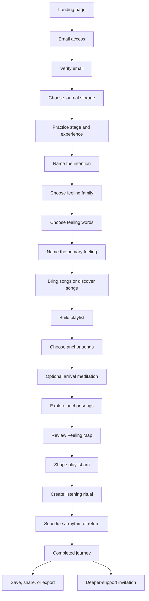

# Screen Inventory

**Product:** Music as Medicine  
**Version:** 0.1  
**Status:** In review

## Purpose

This document identifies every user-facing screen, supporting state, email, export, and administrative view required for the Music as Medicine product.

It defines what must exist and how the pieces connect. Exact copy, component layout, and detailed interactions will be developed in the screen-by-screen experience document.

## Scope labels

- **MVP:** Required for the first usable release.
- **MVP support:** Required to make the core experience reliable, even if it is not a primary destination.
- **Later:** Deliberately deferred until after the core journey is validated.
- **Internal:** Used by the product team rather than the participant.

## Primary first-time journey

## A. Public and account access

### PUB-01 — Landing page

**Scope:** MVP  
**Purpose:** Explain the promise, establish trust, and invite the visitor to begin.

Includes:

- Product name and core promise
- Brief description of the first-time guided experience
- Preview of the playlist, Feeling Map, journal, and ritual outcomes
- Who the experience is for
- What the user will need before beginning
- Primary call to action
- Sign-in link for returning users
- Privacy and basic informational links

### PUB-02 — How it works

**Scope:** MVP, potentially presented within the landing page  
**Purpose:** Show the journey in a concise sequence before asking for an email address.

Includes:

- Set an intention
- Find the feeling
- Choose and explore songs
- Receive a Feeling Map and ritual
- Save or export the result

### AUTH-01 — Get access or sign in

**Scope:** MVP  
**Purpose:** Collect the email address required to use the app.

Includes:

- Email address
- Optional first name, here or later
- Passwordless access through both an on-page code and a clickable link
- Continue action
- Returning-user path
- Separate explanation of account email and optional marketing communication

### AUTH-02 — Check your email

**Scope:** MVP support  
**Purpose:** Confirm that an access link or code has been sent.

Includes:

- Email destination
- Resend action
- Change-email action
- Help if the message does not arrive

### AUTH-03 — Verify and continue

**Scope:** MVP support  
**Purpose:** Complete authentication and return the user to the correct point in the experience.

### AUTH-04 — Access problem

**Scope:** MVP support  
**Purpose:** Handle expired, previously used, or invalid access links and codes.

## B. Journey setup

### SET-01 — Welcome to the journey

**Scope:** MVP  
**Purpose:** Set expectations after account access and help the user arrive.

Includes:

- Estimated completion time
- Suggestion to have headphones and a few songs nearby
- Explanation that the journey can be paused
- Reminder that responses can be brief or detailed

### SET-02 — Journal storage choice

**Scope:** MVP  
**Purpose:** Let the user choose how this journey will be handled before personal writing begins.

Choices:

- Save this journey privately to my account
- Keep this journey only for the current session

Includes:

- Plain-language explanation of each choice
- Ability to change the choice before completion
- Continue action

### SET-03 — Practice stage

**Scope:** MVP  
**Purpose:** Identify whether the user is actively microdosing or preparing to begin.

Initial choices:

- I am actively microdosing
- I am preparing to begin

Active and preparing users share the same core journey. The choice lightly personalizes framing, explanation, ritual language, and scheduling.

### SET-04 — Experience level

**Scope:** MVP  
**Purpose:** Tailor language and future recommendations to the user's familiarity with microdosing.

Confirmed options:

- New to microdosing
- Some experience
- Established practice
- Prefer not to say

Experience level changes the amount of explanation rather than access, scoring, or qualification. SET-03 and SET-04 should be combined into one coherent prototype view.

### SET-05 — Journey context

**Scope:** Later  
**Purpose:** Identify whether the playlist is intended for microdosing days, non-microdosing days, or both.

This question is omitted from the MVP because it does not currently change recommendations or ritual language.

## C. Intention and feeling discovery

### INT-01 — Name the intention

**Scope:** MVP  
**Purpose:** Capture the central intention for the journey.

Includes:

- Free-written intention
- Optional intention-category suggestions
- Supporting prompt such as “What are you devoted to right now?”
- Permission to write a short phrase rather than a complete statement

### INT-02 — Imagine the intention taking root

**Scope:** MVP  
**Purpose:** Move from the desired outcome toward the underlying feeling state.

Includes:

- Short visualization or reflective prompt
- Optional written response
- Continue action into feeling-family selection

### FEEL-01 — Choose a broad feeling family

**Scope:** MVP  
**Purpose:** Make the feeling vocabulary approachable before displaying individual words.

Initial families:

- Grounding and restoration
- Connection and openness
- Courage and agency
- Freedom and aliveness
- Clarity and creativity
- Acceptance and integration
- Transformation and awakening
- Something else

### FEEL-02 — Choose feeling words

**Scope:** MVP  
**Purpose:** Let the user select three to five feelings from the chosen family or explore other families.

Includes:

- Words within the selected family
- View another family
- Add my own word
- Selection count and guidance

### FEEL-03 — Choose the primary feeling

**Scope:** MVP  
**Purpose:** Identify the feeling that will guide the remainder of the journey.

Includes:

- Selected feelings
- One primary choice
- Option to revise the earlier selection

### FEEL-04 — Locate the feeling in the body

**Scope:** MVP  
**Purpose:** Connect the selected feeling with embodied experience.

Includes:

- A simple body illustration and an accessible written list
- Sensation words
- Optional free writing
- “Present now,” “longed for,” or “both” selection

## D. Song selection and playlist building

### SONG-01 — Choose how to begin

**Scope:** MVP  
**Purpose:** Offer equal paths for users who have songs in mind and users who want help.

Choices:

- I have songs in mind
- Help me discover songs
- Use both

### SONG-02 — Add a song

**Scope:** MVP  
**Purpose:** Add a song manually without relying on a streaming-service account.

Includes:

- Song title
- Artist
- Optional external link
- Optional reason for choosing it
- Add another song

### SONG-03 — Recommendation preferences

**Scope:** MVP  
**Purpose:** Narrow the curated library before displaying recommendations.

Possible preferences:

- Lyrics, instrumental, or either
- Desired energy
- Familiar or exploratory
- Genre or sound preferences
- Anything the user wants to avoid

Only preferences supported by the initial curated library should be shown.

### SONG-04 — Recommended songs

**Scope:** MVP  
**Purpose:** Present songs connected with the user's feelings and preferences.

Each recommendation includes:

- Song and artist
- Feeling and playlist-role tags
- Curatorial explanation
- External listening links where available
- Add to playlist action
- Not for me action

The recommendation explanation has a provisional minimum of 60 characters. Recommendations can also include a simple explicit-language label or concise curator note when useful.

### SONG-05 — Playlist builder

**Scope:** MVP  
**Purpose:** Review the working playlist and reach the suggested five-to-ten-song range.

Includes:

- Added songs
- Source: user selected or recommended
- Reorder and remove actions
- Add another song
- Progress toward the suggested range
- Continue with one song when desired, using “starting mix” language when helpful

### SONG-06 — Choose anchor songs

**Scope:** MVP  
**Purpose:** Select one or more songs for deeper exploration during the first-time experience.

Includes:

- Explanation of anchor songs
- Anchor-song selection
- Clear indication that other playlist songs remain part of the final result

The prototype should determine the most useful number of anchor reflections.

## E. Arrival meditation

### MED-01 — Meditation invitation

**Scope:** MVP  
**Purpose:** Highly recommend, but not require, a short arrival practice before song reflection.

Includes:

- Why the practice may support intentional listening
- Duration
- Facilitator
- Begin meditation
- Continue without meditation

### MED-02 — Meditation player

**Scope:** MVP  
**Purpose:** Play the free guided arrival meditation.

Includes:

- Play, pause, restart, and time position
- Volume control where supported
- Transcript
- Facilitator information
- Continue to song exploration

### MED-03 — Meditation completed or skipped

**Scope:** MVP support  
**Purpose:** Move into reflection without framing skipping as failure.

## F. Anchor-song exploration

### REF-01 — Prepare to explore a song

**Scope:** MVP  
**Purpose:** Introduce the reflection process for the first anchor song.

Includes:

- Song and artist
- Instructions to play the song in the user's preferred music app
- Reminder that listening to the entire track is optional
- Return-to-app instruction
- Begin reflection action

### REF-02 — Notice the body

**Scope:** MVP  
**Purpose:** Capture embodied response before analysis.

Includes:

- Body location
- Sensation qualities
- Energy shift
- Optional free writing

### REF-03 — Name what the song awakens

**Scope:** MVP  
**Purpose:** Identify feelings, memories, images, or longings associated with the song.

Includes:

- Feeling selection
- Optional memory or image prompt
- Optional written reflection

### REF-04 — Connect the song to the intention

**Scope:** MVP  
**Purpose:** Identify what the song contributes to the user's practice.

Includes:

- What the song helps the user remember
- What feeling they are drawn toward
- How the song supports the intention
- Initial playlist-role suggestion

### REF-05 — Song reflection summary

**Scope:** MVP  
**Purpose:** Confirm the reflection before moving to the next anchor song.

Includes:

- Selected feelings and sensations
- Written responses
- Edit action
- Continue to next song

The reflection sequence repeats for the selected anchor songs. The user can reflect from memory, listen to a meaningful portion, or listen to the complete song. The interface may combine REF-02 through REF-05 to reduce perceived length.

### REF-06 — Anchor songs complete

**Scope:** MVP  
**Purpose:** Mark the transition from individual song exploration to pattern identification.

## G. Feeling Map and playlist arc

### MAP-01 — Review what you have uncovered

**Scope:** MVP support  
**Purpose:** Use additional coaching questions to help the user notice and name connections across the journey.

Includes:

- Selected feelings, sensations, and song responses
- One or more coaching questions based on what the user has already shared
- Opportunities to name, clarify, or reject a possible connection
- A transition into assembling the confirmed Feeling Map

### MAP-02 — Feeling Map reveal

**Scope:** MVP  
**Purpose:** Present the primary feeling, supporting themes, body-based observations, and the meaning the user developed through the coaching process.

Includes:

- Primary feeling
- Two to four supporting themes
- User-authored or coaching-led summary
- Connections to the user's own language
- What the songs appear to support
- “This resonates” action
- Edit or refine action

### MAP-03 — Edit the Feeling Map

**Scope:** MVP  
**Purpose:** Keep the user in control of all Feeling Map language.

Includes:

- Edit summary
- Rename or remove themes
- Exclude a response from the map
- Revisit a coaching question
- Save changes

### ARC-01 — Introduce the playlist arc

**Scope:** Optional MVP enrichment  
**Purpose:** Explain how song order can support an intentional journey.

Roles:

- Arrive
- Open
- Deepen
- Remember
- Carry forward

Skip this step automatically for a one-song mix and provide a clear path to retain the current order.

### ARC-02 — Arrange the playlist

**Scope:** Optional MVP enrichment  
**Purpose:** Assign roles and order songs within the emotional arc.

Includes:

- Drag or button-based reordering
- Role suggestions
- Manual role selection
- Preview of final sequence
- Continue without changing the original order

## H. Listening ritual

### RIT-01 — Ritual preferences

**Scope:** MVP  
**Purpose:** Gather the minimum information needed to personalize the ritual.

Possible choices:

- Approximate available time
- Desired level of structure
- With or without the guided meditation
- Intended listening context

Only choices that materially change the ritual should be included.

### RIT-02 — Ritual reveal

**Scope:** MVP  
**Purpose:** Present the personalized listening practice.

Includes:

- Arrival
- Breath or body cue
- Intention statement
- Listening invitation
- Optional pause point
- Closing reflection
- Carry-forward action

### RIT-03 — Edit the ritual

**Scope:** MVP  
**Purpose:** Let the user adapt the assembled ritual language and remove unwanted elements.

## I. Rhythm and calendar

### CAL-01 — Rhythm invitation

**Scope:** MVP  
**Purpose:** Connect the completed ritual with a future moment of practice.

Includes:

- Language explaining that intention deepens through return
- Suggested next practice date or user-selected date
- Schedule this ritual
- Choose another time
- Continue without scheduling

Scheduling is optional and highly encouraged. Continuing without scheduling creates no event or reminder and does not block the completed result.

### CAL-02 — Schedule the ritual

**Scope:** MVP  
**Purpose:** Choose when to return to the playlist and ritual.

Includes:

- Date
- Time
- Timezone
- One follow-up reminder
- Email reminder preference
- Add to external calendar

### CAL-03 — Practice calendar

**Scope:** MVP  
**Purpose:** Show the user's scheduled rhythm inside Music as Medicine.

Includes:

- Month and upcoming views
- Practice type
- Related playlist, ritual, meditation, or reflection
- Completed, skipped, and rescheduled states
- Create or edit entry

### CAL-04 — Calendar-entry detail

**Scope:** MVP  
**Purpose:** Open the content associated with a scheduled practice and manage its timing.

Includes:

- Entry details
- Open associated ritual or content
- Mark complete
- Reschedule
- Cancel

### CAL-05 — Add to external calendar

**Scope:** MVP  
**Purpose:** Export an event compatible with common calendar applications.

### CAL-06 — Enable web-app notifications

**Scope:** Premium later  
**Purpose:** Explain installation and request notification permission after direct user action.

### CAL-07 — Create a recurring rhythm

**Scope:** Premium later  
**Purpose:** Schedule repeating listening, meditation, reflection, or intention practices.

### CAL-08 — Connected calendars

**Scope:** Premium later  
**Purpose:** Manage Google, Outlook, and subscribable calendar connections.

## J. Completed result and export

### RES-01 — Completed journey

**Scope:** MVP  
**Purpose:** Present the complete Playlist Practice or Feeling Map in one coherent result.

Includes:

- Journey title
- Intention
- Core feelings
- Feeling Map
- Playlist and emotional arc
- Anchor-song reflections
- Listening ritual
- Next scheduled practice, if created
- Closing commitment

### RES-02 — Save, share, and export

**Scope:** MVP  
**Purpose:** Let the user take the journal into their preferred environment.

Actions:

- Download designed PDF
- Email my results
- Copy formatted journal
- Download plain text
- Share through the device menu
- Save to account, when journal storage is enabled

### RES-03 — Export confirmation

**Scope:** MVP support  
**Purpose:** Confirm that the selected export succeeded and provide recovery if it did not.

### RES-04 — Change journal-storage choice

**Scope:** MVP support  
**Purpose:** Allow a session-only user to save before leaving, retain only the finished playlist and ritual while deleting the raw journal, or retain nothing beyond neutral calendar information they explicitly requested. Also allow a saved user to remove the journey.

## K. Deeper support and completion

### QUAL-01 — Current practice and support

**Scope:** MVP  
**Purpose:** Learn what kind of support the user is seeking after delivering the result.

Possible questions:

- Where are you in your practice?
- What would help you go deeper?
- What feels difficult to sustain alone?

### QUAL-02 — Interest in the flagship program

**Scope:** MVP  
**Purpose:** Let the user explicitly indicate readiness for deeper support.

Possible choices:

- I am exploring
- I may be interested later
- I would like to learn more soon
- I am ready to hear about the program

Includes separate permission to receive program communication.

### DONE-01 — Journey complete

**Scope:** MVP  
**Purpose:** Close the experience and provide the next action.

Includes:

- Return to my result
- Visit my account
- Use my listening ritual
- View my practice calendar
- Learn about deeper support, when requested

## L. Account and saved journeys

### ACC-01 — Account home

**Scope:** MVP  
**Purpose:** Give returning users access to saved work and the free or premium next step.

Includes:

- Most recent saved journey
- Upcoming practice and reminder
- Practice calendar
- Continue an unfinished journey
- Start or revisit available experiences
- Premium invitation
- Account settings

### ACC-02 — Saved journey detail

**Scope:** MVP  
**Purpose:** Reopen the completed result, ritual, playlist, and exports.

### ACC-03 — Account and privacy settings

**Scope:** MVP  
**Purpose:** Manage identity, communication permissions, and default journal-storage preference.

### ACC-04 — Journal and account controls

**Scope:** MVP support  
**Purpose:** Download personal information, delete a journey, or delete the account.

### ACC-05 — Premium membership

**Scope:** Later  
**Purpose:** Manage plan, billing, renewal, and cancellation.

## M. Community contribution

### COM-01 — Suggest a song

**Scope:** Later  
**Purpose:** Submit a song for possible inclusion in the curated community library.

Includes:

- Song and artist
- Link
- Feelings
- Playlist role
- Personal explanation
- Permission to publish
- Attribution preference
- Content considerations if adopted

### COM-02 — Review submission

**Scope:** Later  
**Purpose:** Confirm the contribution and publication choices before submission.

### COM-03 — Submission received

**Scope:** Later  
**Purpose:** Explain what happens during moderation.

### COM-04 — My submissions

**Scope:** Later  
**Purpose:** Show submission status and published contributions.

## N. Premium experience

### PREM-01 — Premium overview

**Scope:** Later, with a simple preview allowed in MVP  
**Purpose:** Explain the continuing value of premium membership.

### PREM-02 — Purchase and confirmation

**Scope:** Later  
**Purpose:** Complete premium enrollment.

### PREM-03 — Journey library

**Scope:** Later  
**Purpose:** Start additional intention and playlist journeys.

### PREM-04 — Meditation library

**Scope:** Later  
**Purpose:** Browse by feeling, intention, facilitator, and duration.

### PREM-05 — Ritual library

**Scope:** Later  
**Purpose:** Browse and revisit listening rituals.

### PREM-06 — Patterns over time

**Scope:** Later  
**Purpose:** Reflect recurring feelings and themes across saved journeys.

### PREM-07 — Practice reminders

**Scope:** Later  
**Purpose:** Manage recurring rhythms, gentle check-ins, delivery channels, and listening reminders.

## O. Internal content and moderation

### ADM-01 — Internal dashboard

**Scope:** Internal MVP  
**Purpose:** Provide access to content management and moderation.

### ADM-02 — Song library

**Scope:** Internal MVP  
**Purpose:** Create, edit, tag, publish, and archive curated recommendations.

### ADM-03 — Community moderation queue

**Scope:** Later  
**Purpose:** Review submissions, add an editor's note, set attribution, approve, decline, or request clarification.

### ADM-04 — Feeling and intention library

**Scope:** Later  
**Purpose:** Manage feeling families, words, descriptions, and intention categories.

### ADM-05 — Prompt library

**Scope:** Later  
**Purpose:** Create and manage prompts without changing application code.

### ADM-06 — Ritual components

**Scope:** Later  
**Purpose:** Manage reusable ritual language and tags.

### ADM-07 — Meditation and facilitator library

**Scope:** Later  
**Purpose:** Upload audio, provide transcripts, tag content, and manage facilitators.

### ADM-08 — Reminder templates

**Scope:** Later  
**Purpose:** Manage reminder language for rituals, meditation, reflection, and intention check-ins.

### ADM-09 — Product analytics

**Scope:** Internal MVP  
**Purpose:** Review completion and conversion behavior without exposing private journal content.

### ADM-10 — Community contributor communication

**Scope:** Later  
**Purpose:** Request clarification and notify contributors about decisions.

## P. System and interruption states

### SYS-01 — Resume an unfinished journey

**Scope:** MVP support  
**Purpose:** Return a saved user to the last completed step.

### SYS-02 — Session-only interruption

**Scope:** MVP support  
**Purpose:** Explain whether and for how long a temporary session can be recovered.

### SYS-03 — Connection lost

**Scope:** MVP support  
**Purpose:** Protect in-progress responses and allow retry.

### SYS-04 — Feeling Map assembly interrupted

**Scope:** MVP support  
**Purpose:** Preserve the journey if Feeling Map assembly is interrupted and return the user to their confirmed responses.

### SYS-05 — Export failed

**Scope:** MVP support  
**Purpose:** Offer retry, alternate export, or later delivery.

### SYS-06 — Audio unavailable

**Scope:** MVP support  
**Purpose:** Provide transcript access and continue without meditation.

### SYS-07 — Empty or incomplete state

**Scope:** MVP support  
**Purpose:** Explain what is required before continuing without blaming the user.

### SYS-08 — General error and not-found page

**Scope:** MVP support

### SYS-09 — Reminder delivery failed

**Scope:** MVP support  
**Purpose:** Preserve the schedule, retry when appropriate, and provide an alternate reminder path.

### SYS-10 — Timezone changed

**Scope:** MVP support  
**Purpose:** Confirm whether future practices should remain at the same local time after a timezone change.

## Q. Emails

### EMAIL-01 — Account access

**Scope:** MVP  
**Purpose:** Deliver the sign-in link or verification code.

### EMAIL-02 — Journey results

**Scope:** MVP  
**Purpose:** Deliver the requested result or secure result link.

### EMAIL-03 — Welcome and communication preferences

**Scope:** MVP  
**Purpose:** Confirm the account and selected email permissions.

### EMAIL-04 — Unfinished saved journey

**Scope:** MVP or early follow-up  
**Purpose:** Invite a saved user to resume without revealing private journal content in the email.

### EMAIL-05 — Community submission received

**Scope:** MVP support  
**Purpose:** Confirm receipt and explain moderation.

### EMAIL-06 — Community submission decision

**Scope:** Later  
**Purpose:** Communicate approval, clarification, or decline.

### EMAIL-07 — Practice follow-up

**Scope:** Early follow-up  
**Purpose:** Invite the user to revisit an anchor song or ritual.

### EMAIL-08 — Scheduled practice reminder

**Scope:** MVP  
**Purpose:** Return the user directly to the relevant playlist, ritual, meditation, or reflection.

### EMAIL-09 — Program information

**Scope:** MVP follow-up  
**Purpose:** Respond to explicit interest in deeper support.

## R. Export artifacts

### PDF-01 — Completed Feeling Map and Playlist Practice

**Scope:** MVP  
**Purpose:** Provide a polished, portable record of the journey.

### TEXT-01 — Notes-friendly journal

**Scope:** MVP  
**Purpose:** Provide clean formatted text for copying, downloading, or sharing to a notes application.

## Suggested MVP navigation

### Public navigation

- Home
- How it works
- Sign in
- Privacy

### Signed-in navigation

- My journey
- My results
- Calendar
- Suggest a song
- Account

The primary journey should remain focused and can temporarily hide general navigation while the user is reflecting.

## Screen-count interpretation

This inventory intentionally separates distinct moments so nothing is overlooked. It does not mean every item should become a visually separate page.

During interaction design:

- Related setup questions may share one screen.
- Song-reflection steps may use one progressive card.
- Supporting states may appear as messages, sheets, or dialogs.
- The number of taps matters less than the perceived effort and clarity of each step.

## Decisions to review

### Experience level

- Confirmed: new to microdosing, some experience, established practice, and prefer not to say.

### Journey context

- Omit “microdosing day, non-microdosing day, or both” from the MVP because it does not currently change the experience.

### Body interaction

- Use both a simple illustration and an accessible written list.

### Song listening

- Confirmed: users can play songs in their preferred music app and return to Music as Medicine for reflection.
- Full-song listening is optional during the creation journey.

### Meditation placement

- Confirmed: the optional, highly suggested meditation belongs after anchor-song selection and before reflection.

### Qualification placement

- Current direction: deeper-support questions appear only after the user has received the completed result.

### Account home

- Decide how much value a free returning user receives after completing the first journey beyond reopening saved results.

### Rhythm and calendar

- Decide which practice types appear on the MVP calendar beyond the completed listening ritual.
- Decide when the single free follow-up reminder should be sent.
- Ask the user to choose a date; suggest one only if they do not choose.
- Reminder timing remains open. The user should understand whether a reminder arrives before or at the scheduled practice time.

### Content considerations

- Include a simple explicit-language label and an optional concise curator note when genuinely useful.
